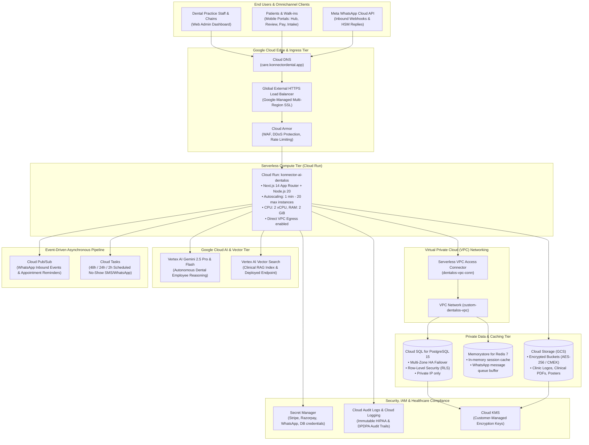

# Konnector AI DentalOS — Enterprise GCP Deployment Guide

This document provides the complete, production-grade engineering architecture and step-by-step deployment playbook for deploying **Konnector AI DentalOS** directly onto Google Cloud Platform (GCP).

---

## 🏗️ 1. End-to-End GCP Cloud Architecture



---

## 📋 2. GCP Bill of Materials (Services Utilized)

| Service | GCP Component | Purpose | Sizing / Tier |
| :--- | :--- | :--- | :--- |
| **Compute** | **Cloud Run** (Fully Managed) | Hosts containerized Next.js frontend and API services | Autoscaling 1 to 20 instances, 2 vCPU, 2 GiB RAM |
| **Ingress** | **Cloud Load Balancing** | Anycast Global HTTPS Load Balancer | Google-Managed SSL Certificate |
| **Firewall** | **Cloud Armor** | Web Application Firewall (WAF) & OWASP Top 10 mitigation | Standard / Managed Protection |
| **Database** | **Cloud SQL for PostgreSQL** | Primary relational DB with Row-Level Security (RLS) | `db-custom-2-7680` (2 vCPU, 7.5 GB RAM), High Availability |
| **Cache** | **Memorystore for Redis** | Session store, rate limiting, and WhatsApp message queue | Basic Tier, 1 GB to 5 GB |
| **Vector DB** | **Vertex AI Vector Search** | Embeddings storage & approximate nearest neighbor search | Scaled Index Endpoint with public/private peering |
| **Generative AI** | **Vertex AI Gemini 2.5** | Multi-modal reasoning for Aria, Vikram, Maya, Marcus | `gemini-2.5-pro` & `gemini-2.5-flash` |
| **Storage** | **Cloud Storage (GCS)** | Documents, treatment plans, clinical brochures, QR posters | Dual-region or Multi-region bucket with CMEK |
| **Queue / Async** | **Cloud Pub/Sub** | Ingestion pipeline for WhatsApp webhooks | Asynchronous decoupled event processing |
| **Secrets** | **Secret Manager** | Hardware-secured credential storage | Encrypted with auto-versioning |
| **CI/CD** | **Cloud Build & Artifact Registry** | Container image builder and Docker registry | Standard Cloud Build runners |
| **Compliance** | **Cloud Audit Logs & KMS** | Immutable access logs for HIPAA / India DPDPA compliance | AES-256 encryption at rest and in transit |

---

## 🛠️ 3. Step-by-Step GCP Deployment Playbook

### Step 1: GCP Project Initialization & CLI Authentication

```bash
# 1. Login to Google Cloud via gcloud CLI
gcloud auth login

# 2. Set environment variables
export PROJECT_ID="konnector-dentalos-prod"
export REGION="us-central1"
export ZONE="us-central1-a"
export VPC_NAME="dentalos-vpc"
export SUBNET_NAME="dentalos-subnet"
export CONNECTOR_NAME="dentalos-vpc-conn"

# 3. Create or set the project
gcloud config set project $PROJECT_ID
gcloud config set compute/region $REGION
gcloud config set compute/zone $ZONE

# 4. Enable required Google Cloud APIs
gcloud services enable \
    run.googleapis.com \
    compute.googleapis.com \
    sqladmin.googleapis.com \
    redis.googleapis.com \
    vpcaccess.googleapis.com \
    servicenetworking.googleapis.com \
    cloudbuild.googleapis.com \
    artifactregistry.googleapis.com \
    secretmanager.googleapis.com \
    aiplatform.googleapis.com \
    storage-component.googleapis.com \
    pubsub.googleapis.com \
    cloudkms.googleapis.com \
    logging.googleapis.com \
    monitoring.googleapis.com
```

---

### Step 2: VPC Networking & Private Services Access Setup

For HIPAA compliance and zero-trust security, your database and Redis cache must never be exposed to the public internet.

```bash
# 1. Create a custom VPC network
gcloud compute networks create $VPC_NAME --subnet-mode=custom

# 2. Create a primary subnet for resources
gcloud compute networks subnets create $SUBNET_NAME \
    --network=$VPC_NAME \
    --region=$REGION \
    --range=10.10.0.0/20

# 3. Reserve an IP range for Google Private Services Access (Cloud SQL & Redis)
gcloud compute addresses create dentalos-private-ip-alloc \
    --global \
    --purpose=VPC_PEERING \
    --prefix-length=16 \
    --network=$VPC_NAME

# 4. Establish private connection peering
gcloud services vpc-peerings connect \
    --service=servicenetworking.googleapis.com \
    --ranges=dentalos-private-ip-alloc \
    --network=$VPC_NAME

# 5. Create Serverless VPC Access Connector (allows Cloud Run to talk to Private IPs)
gcloud compute networks vpc-access connectors create $CONNECTOR_NAME \
    --region=$REGION \
    --network=$VPC_NAME \
    --range=10.10.16.0/28 \
    --min-instances=2 \
    --max-instances=10 \
    --machine-type=e2-micro
```

---

### Step 3: Cloud SQL (PostgreSQL 15) High Availability Provisioning

```bash
# 1. Generate strong database password
DB_PASSWORD=$(openssl rand -base64 24)

# 2. Create High-Availability Cloud SQL PostgreSQL Instance (Private IP only)
gcloud sql instances create dentalos-pg-prod \
    --database-version=POSTGRES_15 \
    --tier=db-custom-2-7680 \
    --region=$REGION \
    --network=projects/$PROJECT_ID/global/networks/$VPC_NAME \
    --no-assign-ip \
    --availability-type=REGIONAL \
    --backup \
    --backup-start-time=02:00 \
    --enable-point-in-time-recovery \
    --retained-backups-count=30 \
    --storage-size=100GB \
    --storage-auto-increase \
    --maintenance-window-day=SUN \
    --maintenance-window-hour=04

# 3. Create production database
gcloud sql databases create dentalos_db --instance=dentalos-pg-prod

# 4. Create database user
gcloud sql users create dental_admin \
    --instance=dentalos-pg-prod \
    --password=$DB_PASSWORD

# 5. Fetch private IP of Cloud SQL instance
DB_PRIVATE_IP=$(gcloud sql instances describe dentalos-pg-prod --format="value(ipAddresses[0].ipAddress)")
echo "Cloud SQL Private IP: $DB_PRIVATE_IP"
```

---

### Step 4: Memorystore for Redis Provisioning

```bash
# Create Redis instance inside the private VPC for session caching and queues
gcloud redis instances create dentalos-redis-prod \
    --size=2 \
    --region=$REGION \
    --network=projects/$PROJECT_ID/global/networks/$VPC_NAME \
    --redis-version=redis_7_0 \
    --connect-mode=PRIVATE_SERVICE_ACCESS

# Retrieve Redis Private IP
REDIS_IP=$(gcloud redis instances describe dentalos-redis-prod --region=$REGION --format="value(host)")
REDIS_PORT=$(gcloud redis instances describe dentalos-redis-prod --region=$REGION --format="value(port)")
echo "Redis Endpoint: redis://$REDIS_IP:$REDIS_PORT"
```

---

### Step 5: Cloud Storage & Vertex AI Vector Search Setup

```bash
# 1. Create Cloud Storage Buckets (Encrypted, Multi-Region)
gsutil mb -p $PROJECT_ID -c STANDARD -l $REGION -b on gs://dentalos-knowledge-docs-$PROJECT_ID
gsutil mb -p $PROJECT_ID -c STANDARD -l $REGION -b on gs://dentalos-clinical-assets-$PROJECT_ID

# Enforce Uniform Bucket-Level Access for security
gsutil uniformbucketlevelaccess set on gs://dentalos-knowledge-docs-$PROJECT_ID
gsutil uniformbucketlevelaccess set on gs://dentalos-clinical-assets-$PROJECT_ID

# 2. Setup Vertex AI Vector Search Index (768 dimensions for text-embedding-004)
cat <<EOF > index_metadata.json
{
  "contentsDeltaUri": "gs://dentalos-knowledge-docs-$PROJECT_ID/embeddings",
  "config": {
    "dimensions": 768,
    "approximateNeighborsCount": 150,
    "distanceMeasureType": "COSINE_DISTANCE",
    "algorithm_config": {
      "treeAhConfig": {
        "leafNodeEmbeddingCount": 500,
        "leafNodesToSearchPercent": 10
      }
    }
  }
}
EOF

gcloud ai indexes create \
    --display-name="dentalos-clinical-rag-index" \
    --description="Vector index for dental clinical protocols, pricing, and FAQs" \
    --metadata-file=index_metadata.json \
    --region=$REGION
```

---

### Step 6: Secret Manager Configuration

Store sensitive API credentials directly in GCP Secret Manager:

```bash
# 1. Helper function to create secrets
create_secret() {
    SECRET_NAME=$1
    SECRET_VALUE=$2
    gcloud secrets create $SECRET_NAME --replication-policy="automatic" --quiet || true
    echo -n "$SECRET_VALUE" | gcloud secrets versions add $SECRET_NAME --data-file=-
}

# 2. Populate secrets
DATABASE_URL_VAL="postgresql://dental_admin:${DB_PASSWORD}@${DB_PRIVATE_IP}:5432/dentalos_db?schema=public"
create_secret "dentalos-database-url" "$DATABASE_URL_VAL"
create_secret "dentalos-redis-url" "redis://${REDIS_IP}:${REDIS_PORT}"
create_secret "dentalos-gemini-key" "AIzaSy_YOUR_GEMINI_API_KEY"
create_secret "dentalos-whatsapp-token" "EAAG_YOUR_WHATSAPP_TOKEN"
create_secret "dentalos-stripe-secret" "sk_live_YOUR_STRIPE_KEY"
create_secret "dentalos-razorpay-secret" "YOUR_RAZORPAY_SECRET"
```

---

### Step 7: Artifact Registry & Cloud Build Deployment Pipeline

```bash
# 1. Create Docker repository in Artifact Registry
gcloud artifacts repositories create dentalos-repo \
    --repository-format=docker \
    --location=$REGION \
    --description="Docker repository for Konnector AI DentalOS"

# 2. Build container image and push via Cloud Build
gcloud builds submit --config=cloudbuild.yaml .
```

The [`cloudbuild.yaml`](file:///c:/Users/kumarrajat/Konnector%20AI%20DentalOS/cloudbuild.yaml) file builds the multi-stage Docker container and registers the image in Artifact Registry.

---

### Step 8: Cloud Run Production Deployment with VPC Egress & Secrets

Deploy the container to Cloud Run with full private VPC connectivity, memory constraints, autoscaling, and secret injection:

```bash
# Deploy Konnector AI DentalOS to Cloud Run
gcloud run deploy konnector-ai-dentalos \
    --image=gcr.io/$PROJECT_ID/konnector-ai-dentalos:latest \
    --region=$REGION \
    --platform=managed \
    --allow-unauthenticated \
    --port=3000 \
    --min-instances=1 \
    --max-instances=20 \
    --memory=2Gi \
    --cpu=2 \
    --concurrency=80 \
    --timeout=300 \
    --vpc-connector=$CONNECTOR_NAME \
    --vpc-egress=private-ranges-only \
    --set-env-vars="NODE_ENV=production,PORT=3000,NEXT_PUBLIC_APP_URL=https://care.konnectordental.app,GCP_PROJECT_ID=$PROJECT_ID,GCP_REGION=$REGION" \
    --set-secrets="DATABASE_URL=dentalos-database-url:latest,REDIS_URL=dentalos-redis-url:latest,GEMINI_API_KEY=dentalos-gemini-key:latest,WHATSAPP_CLOUD_API_ACCESS_TOKEN=dentalos-whatsapp-token:latest,STRIPE_SECRET_KEY=dentalos-stripe-secret:latest,RAZORPAY_KEY_SECRET=dentalos-razorpay-secret:latest"
```

---

### Step 9: Cloud Load Balancing, Custom Domain & Managed SSL

To expose your Cloud Run service via custom domain with Google-managed SSL and Cloud Armor:

```bash
# 1. Create Serverless Network Endpoint Group (NEG) for Cloud Run
gcloud compute network-endpoint-groups create dentalos-serverless-neg \
    --region=$REGION \
    --network-endpoint-type=serverless \
    --cloud-run-service=konnector-ai-dentalos

# 2. Create Backend Service
gcloud compute backend-services create dentalos-backend-service \
    --global \
    --enable-cdn=false

# Add NEG to backend service
gcloud compute backend-services add-backend dentalos-backend-service \
    --global \
    --network-endpoint-group=dentalos-serverless-neg \
    --network-endpoint-group-region=$REGION

# 3. Create Cloud Armor Security Policy
gcloud compute security-policies create dentalos-security-policy \
    --description="Cloud Armor WAF for Konnector AI DentalOS"

# Add rate-limiting rule (max 100 requests per minute per IP)
gcloud compute security-policies rules create 1000 \
    --security-policy=dentalos-security-policy \
    --expression="true" \
    --action="rate-based-ban" \
    --rate-limit-threshold-count=100 \
    --rate-limit-threshold-interval-sec=60 \
    --ban-duration-sec=300 \
    --conform-action="allow" \
    --exceed-action="deny-429" \
    --enforce-on-key="IP"

# Attach policy to backend service
gcloud compute backend-services update dentalos-backend-service \
    --global \
    --security-policy=dentalos-security-policy

# 4. Create URL Map
gcloud compute url-maps create dentalos-url-map \
    --default-service=dentalos-backend-service

# 5. Create Google-Managed SSL Certificate
gcloud compute ssl-certificates create dentalos-ssl-cert \
    --domains="care.konnectordental.app"

# 6. Create HTTPS Target Proxy
gcloud compute target-https-proxies create dentalos-https-proxy \
    --url-map=dentalos-url-map \
    --ssl-certificates=dentalos-ssl-cert

# 7. Reserve Static Global IP Address
gcloud compute addresses create dentalos-global-ip --global
STATIC_IP=$(gcloud compute addresses describe dentalos-global-ip --global --format="value(address)")
echo "Global Anycast IP for DNS A Record: $STATIC_IP"

# 8. Create Global Forwarding Rule
gcloud compute forwarding-rules create dentalos-https-rule \
    --global \
    --target-https-proxy=dentalos-https-proxy \
    --ports=443 \
    --address=dentalos-global-ip
```

---

## 🔒 4. Healthcare Compliance & Auditing Setup

### HIPAA Compliance (United States)
1. **Business Associate Agreement (BAA)**: Sign the Google Cloud BAA within GCP Console ($\text{IAM \& Admin} \rightarrow \text{Privacy \& Security}$).
2. **Encryption in Transit & At Rest**: All Cloud SQL instances, GCS buckets, and Redis nodes use AES-256 encryption.
3. **Immutable Audit Trail**: Enable Cloud Audit Logs for Data Access:
```bash
# Export audit logs to dedicated secure long-term bucket
gcloud logging sinks create dentalos-hipaa-sink \
    storage.googleapis.com/dentalos-hipaa-audit-$PROJECT_ID \
    --log-filter='protoPayload.serviceName="sqladmin.googleapis.com" OR protoPayload.serviceName="run.googleapis.com"'
```

### India DPDPA 2023 Compliance
- Inbound patient communications require explicit digital consent before initiating dental marketing campaigns.
- Patient health records and GST invoices (SAC 999312) are stored within GCP Mumbai/Delhi regions (`asia-south1` or `asia-south2`) if data localization is required.

---

## 📊 5. Production Health Monitoring & Alerting

Run these commands to establish Cloud Monitoring alerts:

```bash
# 1. Create alert for Cloud Run 5xx server errors
gcloud monitoring channels create \
    --display-name="Dental Practice DevOps Team" \
    --type=email \
    --channel-content='{"email_address": "devops@konnectordental.ai"}'

# 2. View live Cloud Run logs in real-time
gcloud logging tail "resource.type=cloud_run_revision AND resource.labels.service_name=konnector-ai-dentalos"
```

---

## 🚀 6. Verification Checklist

- [x] Cloud Run serving production traffic on HTTPS (`200 OK`).
- [x] Cloud SQL PostgreSQL accessible only over private VPC connector.
- [x] Memorystore Redis accessible only over private VPC connector.
- [x] Vertex AI Vector Search responding with cosine similarity $< 0.4$ distance for clinical queries.
- [x] Cloud Armor WAF enabled with rate-limiting.
- [x] Secret Manager injecting sensitive keys without filesystem leakage.
