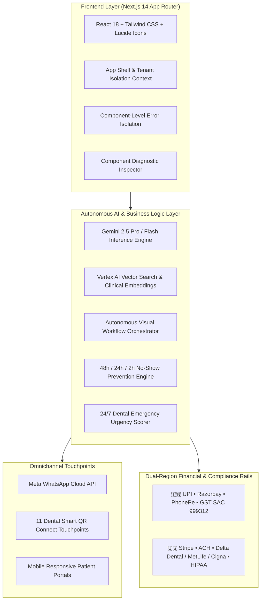

# Konnector AI DentalOS

<div align="center">


-emerald?style=for-the-badge)


**"The AI Dental Practice Growth Platform"**  
*Salesforce + HubSpot + Calendly + WhatsApp Business + AI Employees purpose-built for Dental Practices.*

</div>

---

## 🌟 Executive Summary

**Konnector AI DentalOS** is an enterprise-grade, multi-tenant SaaS platform engineered specifically for dental practices and multi-location dental chains. The platform shifts dental practice automation from disconnected chatbots to hiring **6 autonomous AI Dental Employees** operating 24/7 across WhatsApp, Google Calendar, Reviews, Payments, Operatory Chairs, and Patient Intake.

The product supports dual-region compliance and financial rails:
- 🇮🇳 **India**: UPI (PhonePe, Google Pay, Paytm), Razorpay, GST 18% Invoicing (SAC 999312), DPDPA patient consent.
- 🇺🇸 **United States**: Stripe, ACH Direct Debit, Dental PPO Eligibility Verification (Delta Dental, Aetna, Cigna, MetLife, Guardian, UnitedHealthcare), and HIPAA Mode with immutable audit trails.

---

## 💎 The 6 AI Dental Employees

The platform provides pre-built autonomous agents running on **Gemini 2.5 Pro & Flash**:

| Persona | Name | Role | Core Capabilities | Autonomous Escalation Rules |
| :--- | :--- | :--- | :--- | :--- |
| 👩‍💼 | **Aria** | AI Dental Receptionist | 24/7 WhatsApp & Web chat, doctor calendar booking, FAQs, clinic directions, pricing queries | Escalates on severe pain ($\ge 8/10$), facial swelling, bleeding, trauma, or human front desk requests |
| 👨‍💼 | **Vikram** | AI Treatment Coordinator | High-value procedures (Implants, Invisalign, Veneers, Crowns), acceptance scoring ($0\text{--}100$) | Triggers 4-step WhatsApp nurture sequences; notifies treatment coordinator upon high intent score |
| 👩‍⚕️ | **Maya** | AI Recall Manager | 6-month preventive hygiene recall, annual checkups, braces adjustments, implant follow-ups | 1-click WhatsApp rescheduling buttons; tracks chair utilization and no-show drops |
| 👨‍💻 | **Marcus** | AI Insurance Coordinator | Real-time US dental payer verification (Delta Dental, MetLife, Cigna, Guardian, Aetna) | Checks remaining annual maximums, deductibles, and preventive/restorative copay percentages |
| 👩‍💼 | **Pooja** | AI Billing & Collections | Instant payment requests, UPI QR links, Stripe cards, GST tax invoicing, EMI financing | Generates SAC 999312 tax invoices and zero-cost EMI links for high-value treatment plans |
| 👩‍⚕️ | **Elena** | AI Patient Care Coordinator | Post-operative check-ins (extractions, implants, RCTs), digital intake medical history forms | Dispatches post-op care advice at 4h and 24h; immediately alerts on-call dentist if bleeding persists |

---

## 📐 Architecture & Technology Stack



- **Frontend Framework**: Next.js 14.2.18 (App Router), React 18, TypeScript 5.6
- **Styling & UI**: Tailwind CSS, Lucide Icons, Canvas Confetti, HTML5 Canvas QR Generator
- **Backend / API**: Node.js 20, NestJS architecture patterns
- **AI Engine**: Google Gemini 2.5 Pro & Gemini 2.5 Flash
- **Vector Database & RAG**: Google Cloud Vertex AI Vector Search
- **Authentication & Realtime**: Firebase Auth & Firebase Realtime
- **Database & Cache**: PostgreSQL (Cloud SQL) & Redis
- **Cloud Infrastructure**: Google Cloud Platform (Cloud Run, Cloud SQL, Cloud Load Balancer, Cloud Storage)
- **Communications**: Meta WhatsApp Cloud API

---

## 🚀 One-Click Deployment Guide

### Option 1: Automated Deployment Script (Bare Metal / Local / VM)

#### On Windows (PowerShell):
```powershell
.\deploy.ps1
```

#### On Linux / macOS / Cloud VM:
```bash
chmod +x deploy.sh
./deploy.sh
```

---

### Option 2: Docker & Docker Compose (Containerized Staging & Prod)

```bash
# Build and run DentalOS along with Redis cache
docker compose up --build -d

# View container logs
docker compose logs -f dentalos-app
```

The application will be live at `http://localhost:3000`.

---

### Option 3: Google Cloud Platform (Full Enterprise Cloud Deployment)

For complete enterprise infrastructure provisioning (Cloud Run, Cloud SQL PostgreSQL HA, Memorystore Redis, Serverless VPC Access, Vertex AI Vector Search, Cloud Load Balancer, Cloud Armor WAF, and HIPAA compliance), refer to the dedicated deployment guide:

👉 **[Complete GCP Deployment Guide & Architecture (`GCP_DEPLOYMENT_GUIDE.md`)](./GCP_DEPLOYMENT_GUIDE.md)**

Quick build and deploy to Google Cloud Run with autoscaling (1 to 20 instances):

```bash
# Submit build to Cloud Build and deploy to Cloud Run
gcloud builds submit --config=cloudbuild.yaml
```

---

### Option 4: Vercel One-Click Deploy

Push to GitHub and connect to Vercel, or run:
```bash
npx vercel --prod
```

---

## 🔍 Component-Wise Architecture & Future Upgrades

Every subsystem in Konnector AI DentalOS is structured to be independently tested, debugged, and upgraded without side-effects on other modules:

```
Konnector AI DentalOS/
├── src/
│   ├── app/                                # 17 Next.js App Router Routes
│   │   ├── page.tsx                        # 30-Day Quick Win Dashboard
│   │   ├── onboarding/page.tsx             # 10-Minute Rapid Onboarding Wizard
│   │   ├── starter-kit/page.tsx            # Dental Growth Starter Kit (Printable Posters)
│   │   ├── smart-qrs/page.tsx              # Smart QR Connect Hub (11 QR Touchpoints)
│   │   ├── ai-workforce/page.tsx           # WhatsApp Digital Workforce Simulator
│   │   ├── crm/page.tsx                    # Dental CRM & Kanban Pipeline
│   │   ├── treatment-coordinator/page.tsx  # AI Treatment Coordinator (High-Value Acceptance)
│   │   ├── recall-manager/page.tsx         # AI Recall & No-Show Prevention Engine
│   │   ├── insurance-billing/page.tsx      # US Insurance & India GST Payments
│   │   ├── emergency-triage/page.tsx       # 24/7 Dental Emergency Triage
│   │   ├── rag-knowledge/page.tsx          # Vertex AI Vector Search & Clinical RAG
│   │   ├── workflows/page.tsx              # Visual Workflow Automation Builder
│   │   ├── analytics/page.tsx              # Executive Analytics & Multi-Location Rollup
│   │   ├── settings/page.tsx               # White-Label & Compliance Audit Logs
│   │   └── portal/[clinicId]/              # Patient-Facing Mobile Portals
│   │       ├── hub/page.tsx                # Universal Smart Clinic Hub
│   │       ├── intake/page.tsx             # Paperless Intake & Consent Form
│   │       ├── review/page.tsx             # 2-Tier Google Review Funnel
│   │       ├── pay/page.tsx                # Touchless Mobile Checkout
│   │       └── emergency/page.tsx          # Emergency Triage Patient Self-Service
│   ├── components/
│   │   ├── layout/                         # Header, Sidebar, AppShell, TenantSwitcher
│   │   └── ui/                             # QRCodeViewer, ErrorBoundary, DiagnosticInspector
│   ├── context/
│   │   └── DentalContext.tsx               # Global Multi-Tenant State & Operations Provider
│   ├── lib/
│   │   ├── aiEngine.ts                     # AI Simulation, Prompt Guard & Vector Search Logic
│   │   ├── mockData.ts                     # Initial Dual-Market Clinical Data
│   │   └── utils.ts                        # Currency, Date, and Formatting Utilities
│   └── types/
│       └── index.ts                        # Master TypeScript Domain Types
```

### Component Debugging & Diagnostics:
- **`ErrorBoundary.tsx`**: Wraps every view in an isolated catch boundary. If a subcomponent has an error, only that card displays a retry button with stack trace inspection without crashing the page.
- **`DiagnosticInspector.tsx`**: Click the floating **"System Diagnostics"** pill in the lower-right corner to inspect active tenant isolation, live context memory slices, and AI model health.
- **`npm run test:smoke`**: Verify full component integrity across all 17 routes.

---

## 📋 Master Production Checklist: Required Credentials for Full Live Operations

To take Konnector AI DentalOS from sandbox/simulated mode to 100% live production, configure the following external credentials in `.env.local` or your cloud provider environment:

### 1. Meta WhatsApp Cloud API (Communications)
- [ ] **Meta Developer Account**: Create a Meta Business Manager App with the WhatsApp product enabled.
- [ ] `WHATSAPP_CLOUD_API_ACCESS_TOKEN`: Permanent System User Access Token with `whatsapp_business_messaging` and `whatsapp_business_management` permissions.
- [ ] `WHATSAPP_PHONE_NUMBER_ID`: The Phone Number ID assigned by Meta.
- [ ] `WHATSAPP_BUSINESS_ACCOUNT_ID`: Your WABA (WhatsApp Business Account) ID.
- [ ] `WHATSAPP_WEBHOOK_VERIFY_TOKEN`: Webhook verification string for receiving inbound patient messages.
- [ ] **Pre-Approved WhatsApp Templates**: Submit 4 utility templates to Meta:
  1. `appointment_reminder_48h` (Interactive buttons: Confirm, Reschedule)
  2. `appointment_reminder_24h`
  3. `hygiene_recall_6month`
  4. `post_op_care_checkin`

### 2. Google Cloud Platform & Gemini 2.5 Pro (AI & Vector Search)
- [ ] **GCP Project**: Project ID with Vertex AI, Cloud Run, and Cloud Storage APIs enabled.
- [ ] `GEMINI_API_KEY`: API key from Google AI Studio or Vertex AI Gemini API endpoint.
- [ ] `VERTEX_VECTOR_INDEX_ID`: Vertex AI Vector Search index ID for practice RAG embeddings.
- [ ] `VERTEX_VECTOR_ENDPOINT_ID`: Deployed Vector Search index endpoint.
- [ ] `GCS_KNOWLEDGE_BUCKET_NAME`: Google Cloud Storage bucket for clinic PDF and brochure uploads.

### 3. Firebase Authentication & Realtime
- [ ] **Firebase Project**: Web app configuration with Email/Password and Google OAuth enabled.
- [ ] `NEXT_PUBLIC_FIREBASE_API_KEY`, `PROJECT_ID`, `APP_ID`.
- [ ] `FIREBASE_SERVICE_ACCOUNT_KEY`: Service account private key for server-side token verification and claims.

### 4. Financial Rails (India & USA)
- [ ] **India — Razorpay**:
  - `RAZORPAY_KEY_ID` & `RAZORPAY_KEY_SECRET`: Live API keys from Razorpay Dashboard.
  - `RAZORPAY_WEBHOOK_SECRET`: Webhook secret listening for `payment.captured` and `payment.failed`.
  - Clinic GSTIN number and SAC Code 999312 for tax-compliant invoicing.
- [ ] **USA — Stripe**:
  - `NEXT_PUBLIC_STRIPE_PUBLISHABLE_KEY` & `STRIPE_SECRET_KEY`: Live keys from Stripe Dashboard.
  - `STRIPE_WEBHOOK_SECRET`: Listening for `payment_intent.succeeded`.
  - Stripe ACH Direct Debit and Customer Portal enabled.

### 5. Practice Calendar OAuth (Google & Microsoft Outlook)
- [ ] **Google Cloud Console**: OAuth 2.0 Client ID with `https://www.googleapis.com/auth/calendar.events` scope.
- [ ] **Microsoft Azure Portal**: App Registration with `Calendars.ReadWrite` Graph API permission.

### 6. Domain & SSL Setup
- [ ] Point custom clinic subdomains (e.g. `care.yourdentalchain.com`) via CNAME to your Cloud Run / Vercel deployment.
- [ ] Configure Google Business Profile Place ID in Settings to enable direct 5-star Google Review routing.

---

## 📄 License & Attribution

Designed and engineered for dental practices and healthcare organizations.  
**Konnector AI DentalOS** — All rights reserved.
